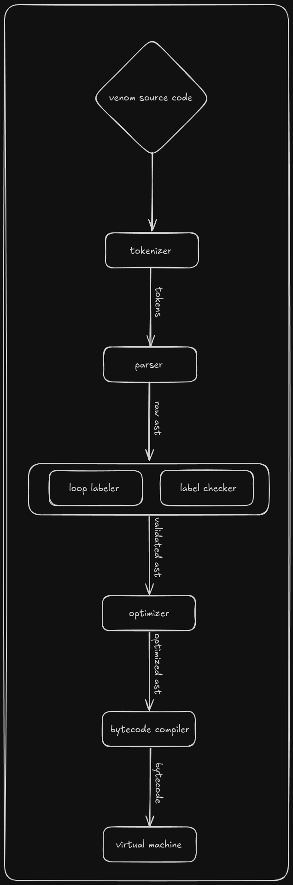

# venom

This is an implementation of a dynamically-typed programming language with automatic memory management via reference counting.  The system incorporates an on-demand lexer based on finite state machines, a handwritten recursive-descent parser, a bytecode compiler, an optimizer, a stack-based virtual machine, and a disassembler.

It also features a conditionally compiled encoding scheme, called **NaN boxing**, which utilizes special IEEE 754 double-precision floating-point NaN values to efficiently encode all objects (up to 2^5 different object types) in just 8 bytes, effectively making stack operations and therefore copying data back-and-forth very inexpensive.

Besides NaN boxing, the implementation also contains an optimizer which takes the abstract syntax tree right after the semantic analysis stage is completed, and passes it through an iterative optimization pipeline, where optimizations like **constant folding**, **unreachable code elimination**, **dead stores elimination**, and **copy propagation** take place.

## Architecture




## Features

- basic data types:
    - numbers
    - strings
    - booleans
    - null
- structured control flow: 
  - if/else
  - while
  - do while
  - for
  - break/continue
  - goto
- Rust-like user-defined structures (struct + impl)
- functions as first-class citizens
  - recursion!
  - return is mandatory
- Python-style decorators
- etc.

### Pretty error reports

```rust
loop_labeler: 'break' statement outside the loop
1 fn main() {
2   let x = 0;
3   if (x == 0) {
4     break;
      ^^^^^^
5   }
6   return 0;
7 }
```

## Compiling

Clone the repository and run:

```
make -j$(nproc)
```

### Debugging individual system components

To enable the debug prints for one of the components of the system, run e.g.:

```
make debug=vm
```

(see Makefile for other options).

### Performance graph

To generate the performance graph, run:

```
make graph.png <file>
```

...where `<file>` could, e.g., be: `benchmarks/fib40.vnm`.

### Compiling with NaN boxing enabled

```
make -j$(nproc) opt=nan_boxing
```

## Tests

The tests are written in Python and venom's behavior is tested externally.

The test suite relies on venom being compiled with `debug=vm,compiler` (`todo!()`) (because of the prefix in debug prints). To run the test suite, create a Python virtual environment and activate it, install `pytest` (ideally also install `pytest-xdist` because it's a time-consuming process), then execute the command below:

```
make test
```

##  Design notes

- The design is the balance among performance and RISC-alikeness. For example, when string concatenation was introduced into the language, there was a choice whether to reuse the current `OP_ADD` opcode or have a separate opcode for string concatenation, e.g. `OP_STRCAT`. At first, I decided to reuse `OP_ADD` (and the `+` operator) at the expense of slightly more complexity in the virtual machine which introduced a performance regression. Later I rewrote the code to use a separate opcode (and the corresponding `++` operator).

- Structures and strings can get arbitrarily large and we do not know their size ahead of time, which required implementing them both underneath as pointers whose size is known. This introduced the whole memory management issue. There were two pathways from here since these pointers need to be freed: either let the venom users explicitly free() their instances, or introduce automatic memory management. I opted for automatic memory management via refcounting because, frankly, I thought I'd have a lot of fun implementing refcounting, but I have to admit that chasing down INCREF/DECREF bugs led to me letting fly a great deal of profanity. ;-)

## Contributing

Contributors to this project are very welcome -- specifically, suggestions (and PRs) as for how to make the whole system even faster, because I suspect there's still more performance left to be squeezed out.

Before submitting a PR, make sure:
- C code is formatted properly (use `make format`)
- Python code (tests) pass the ruff check (use `make ruff`)
- all tests pass

There is also a pre-commit hook in the `hooks` folder that you could copy/paste into your `.git/hooks` folder which helps with this process.

## See also

- [synapse](https://github.com/xqb64/synapse) - My second attempt, written in Rust
- [viper](https://github.com/xqb64/viper) - My third attempt, a tree-walk interpreter for a dynamic language, written in Python
- [ucc](https://github.com/xqb64/ucc) - My fourth attempt, an optimizing compiler for a large subset of the C programming language, written in Rust
## Licensing

Licensed under the [MIT License](https://opensource.org/licenses/MIT). For details, see [LICENSE](https://github.com/xqb64/venom/blob/master/LICENSE).
